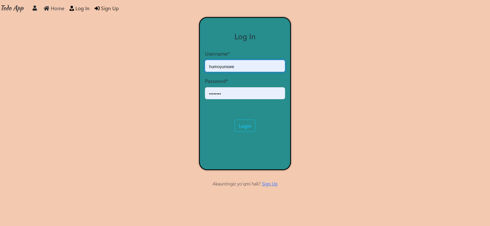
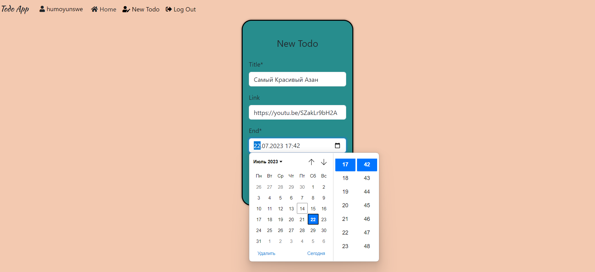
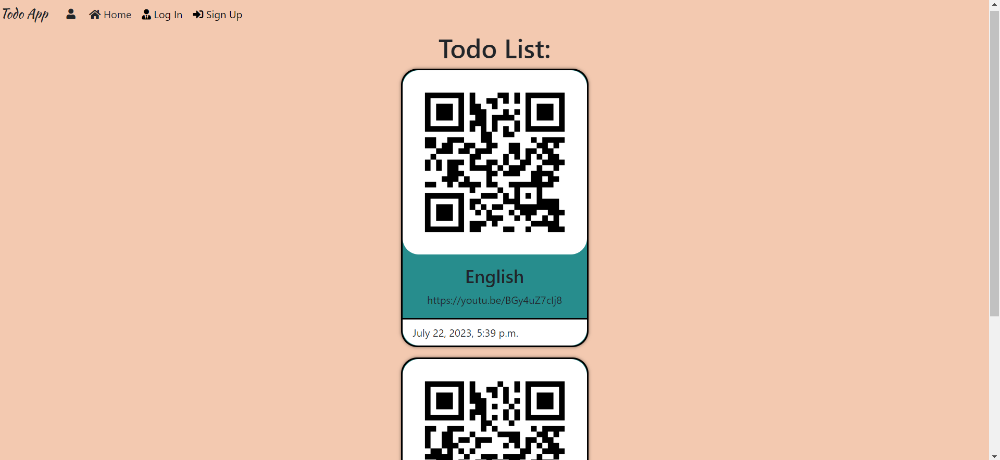

# Todo_APP


## Документация по Todo App

> Todo App - это веб-приложение, которое позволяет пользователям создавать свои собственные задачи (тодо) и отслеживать их статус. Пользователи могут создавать задачи, указывать заголовок, ссылку на задачу и дату выполнения. Кроме того, для каждой задачи генерируется QR-код, который позволяет быстро получить доступ к задаче через мобильное устройство.




**Пример программы так работает.**


## Установка

**Для установки программы, выполните следующие шаги:**

1. Установите Python на вашу систему, если он еще не установлен. Вы можете скачать Python с официального сайта: https://www.python.org/downloads/

2. Клонируйте репозиторий с GitHub:
 ```bash
$  git clone  https://github.com/Humoyun004/Todo_APP_New.git
```

3. Перейдите в директорию с программой:
cd PostApp 

## Использование
**После того, как вы загрузили django, перейдите в каталог клонированного репо и выполните следующую команду**
```bash
$ python manage.py makemigrations
```

**Это создаст все файлы миграции (миграции базы данных), необходимые для запуска этого приложения.**

**Теперь, чтобы применить эту миграцию, выполните следующую команду**
```bash
$ python manage.py migrate
```
**Один последний шаг, и тогда наше приложение Post будет запущено. Нам нужно создать пользователя-администратора для запуска этого приложения. В терминале введите следующую команду и укажите имя пользователя, пароль и адрес электронной почты для пользователя-администратора.**
```bash
$ python manage.py createsuperuser
```
 **Запустите программу с помощью команды:**
```bash
$ python manage.py runserver
```
### Создание задачи(Todo)
1. **На домашней странице нажмите кнопку "New Todo", чтобы создать новую задачу.**
2. **Введите заголовок задачи, ссылку на задачу и выберите дату выполнения.**
3. **Нажмите кнопку "Create" для создания задачи.**


### Просмотр  списка задач
1. **На домашней странице вы увидите список всех созданных вами задач.**
2. **Каждая задача будет отображать заголовок, ссылку на задачу и дату выполнения.**
3. **Рядом с каждой задачей будет QR-код, содержащий ссылку на задачу. Вы можете отсканировать QR-код с помощью мобильного устройства, чтобы быстро получить доступ к задаче.**

### Вход и выход из системы
1. **Для выхода из аккаунта нажмите кнопку "Log Out" на главной странице.**
2. **После выхода из системы вы будете перенаправлены на страницу входа.**


## Вклад
**Если вы хотите внести свой вклад в развитие приложения "Блог на Django", пожалуйста, следуйте этим шагам:**

1. Форкните репозиторий на GitHub.
2. Клонируйте ваш форк репозитория на локальную машину.
3. Создайте новую ветку для вашей функции или исправления ошибки.
4. Внесите изменения и сделайте коммиты с описательными сообщениями.
5. Отправьте ваши изменения в ваш форк репозитория.
6. Создайте pull request (запрос на включение) в основной репозиторий.

## Благодарности
- Фреймворк Django: https://www.djangoproject.com/
- Фреймворк Bootstrap: https://getbootstrap.com/

## Дополнительные ресурсы
- **Документация Django:** https://docs.djangoproject.com/

## Контакты
**Если у вас есть вопросы или предложения относительно приложения "Блог на Django", пожалуйста, свяжитесь с нами по адресу humoyunakbaraliev1@gmail.com. Мы ценим ваше мнение!**


